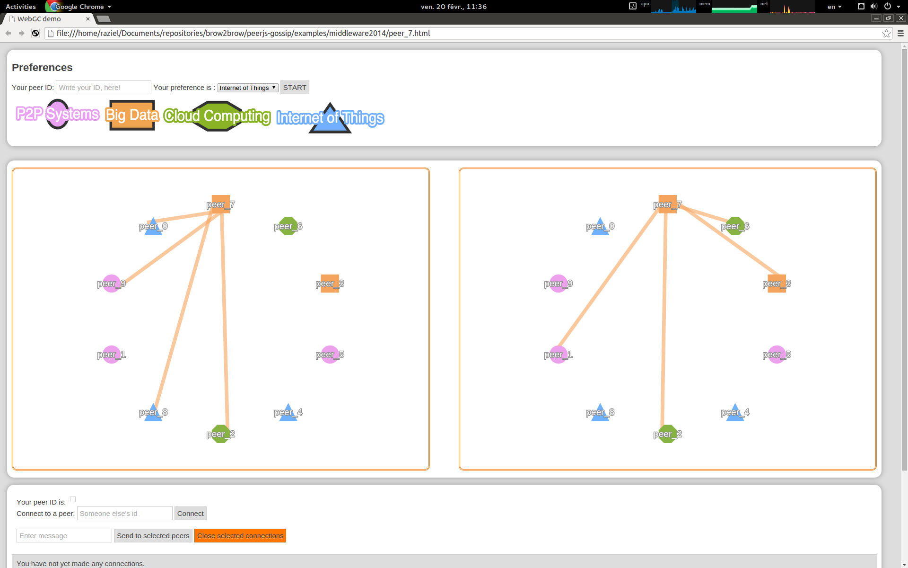

# WebGC
WebGC is a peer-to-peer (P2P) library to coordinte the execution of gossip protocols, e. i. a gossip-based library. This project uses [WebRTC](http://www.webrtc.org/) to communicate web browsers with each others and depends of [PeerJS](http://peerjs.com/) (we plan to get rid of this dependency), this project provides a P2P communication API (send, receive, etc) to exchange data over the Internet via the Peer object. WebGC offers a catalog of gossip protocols which is maintain by the library, users can extend this catalog via the implementation of the ```GossipProtocol``` interface.


#Installation instructions
WebGC is a front-end library but in order to execute all the examples it is required to have the next programs installed: [NodeJS](http://nodejs.org/) (node is used generally in back-end applications and it is required for bootstrapping the communication with peers in PeerJS), [Bower](http://bower.io/), [NPM](https://www.npmjs.org/), the scripts of the examples requires Chrome (31 or higher) but WebGC is compatible with Firefox too, furthermore, peers running on Chrome can reach others running Firefox. Once you are done with the last requirements, do as follows:

- type ``` bower install ``` in the main directory

Now you are done with the front-end part; additionally you must clone the PeerJS-Server Gossip project as follows:

- Clone PeerJS-Server Gossip typing: ``` git clone               
  git+ssh://<user>@scm.gforge.inria.fr//gitroot/serverjs-gossip/serverjs-gossip.git  ```
  the ``` <user> ``` tag must be replaced with your user's name
- Type ```npm install``` in the main directory
- That's it, refer to the ```README.md ``` file for more information about the project and why WebGC needs it

# Examples
For the moment there is one example that coordinates the execution of two gossip protocols, Random Peer Sampling (RPS) and clustering protocol, to discover peers with similar profiles. This example was presented in [Middleware 2014](http://2014.middleware-conference.org/program/posters/) in the session of demos and posters, for more information about this example refer to the file ```examples/middleware2014/README.md```, and its execution is done via the script ```examples/middleware2014/launchDemo.sh``` that accepts three parameters  ```<peers>, <execution-time>, <serverjs-gossip-dir>``` where:

- ```<peers>``` is the number of peers in the test (integer),
- ```<execution-time>``` is the duration (in minutes) of the test (integer) and
- ```<serverjs-gossip-dir>``` is the directory where you clone the ServerJS-Gossip project

### Script execution
Type:

- ```cd <PATH>/peerjs-gossip/examples/middleware2014```
    - Where ```<PATH>``` is the directory that contains both projects, PeerJS-Gossip and
    ServerJS-Gossip.

- ```./launchDemo.sh 10 5 <PATH>/serverjs-gossip```

whit the last execution ten windows of Chrome are going to appear during five minutes, on each window the graph of the left represents the P2P overlay of the RPS protocol and the other graph represents the overlay of clustering protocol as it is shown in the next image: 



##Non local execution
```Loading...```

#Code Documentation
You can find the documentation of each object in this library at the ```doc ``` folder

## Create a new documentation
This project uses [JSDoc](https://github.com/jsdoc3/jsdoc) to create the documentation of the code
at the ```src``` directory. In order to generate a new documentation you must install JSDoc
through [Bower](http://bower.io/). **NOTE** dependencies for development are written in the file
```bower.json``` but there is not any task for the generation at ```Gruntfile.js```

#Compatibility
This project is compatible with Linux based systems (tested in Ubuntu 14.10) and MacOS (OS X Yosemite version 10.10), the web browser Chrome (version 38 or higher) must be installed too. Do not hesitate to report any issue or comment with the project.

#TODO
- Take rid off PeerJS
- Launch WebGC on NodeJS
- Take rid off the signaling server